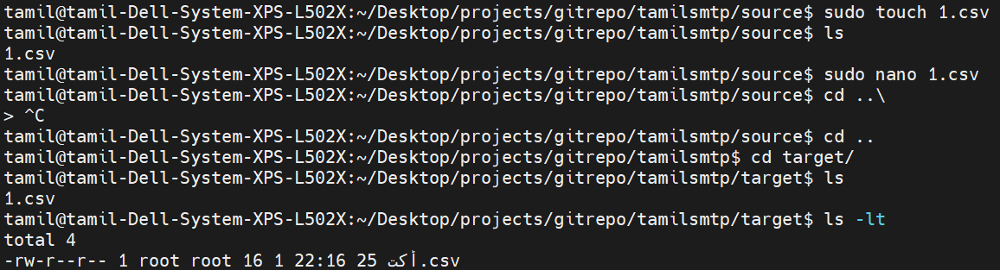
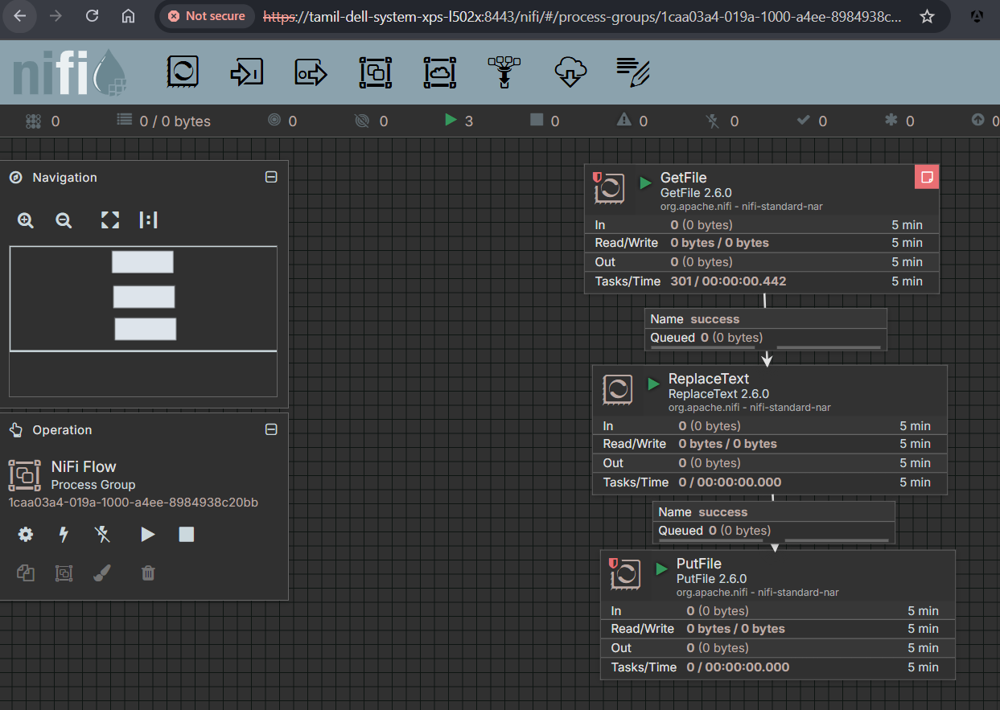

## Apache NiFi Overview

Apache NiFi is a powerful data integration tool for automating the flow of data between systems with real-time monitoring, data provenance, and visual flow design.

### When to Use NiFi
- **Real-time data ingestion** from multiple sources (databases, APIs, files, IoT devices)
- **Data routing and transformation** with complex business logic
- **System integration** requiring reliable data delivery with back-pressure handling
- **Data governance** needs with built-in provenance and lineage tracking
- **Visual flow design** preferred over coding for data pipelines

### When NOT to Use NiFi
- **High-volume batch processing** where tools like Spark are more efficient
- **Simple ETL jobs** that don't require real-time processing
- **Memory-intensive analytics** or complex computations
- **Resource-constrained environments** due to JVM overhead
- **Pure streaming analytics** where specialized tools like Kafka Streams excel

### Key Components

- **Processor**: Core building block that performs specific data operations (read, write, transform, route)
- **FlowFile**: Immutable data object containing content and attributes that flows through the system
- **Processor Group**: Logical container for organizing related processors and managing scope
- **Remote Processor Group**: Enables data transfer between different NiFi instances across networks
- **Funnel**: Combines multiple connections into a single output for flow organization
- **Parameter Context**: Centralized configuration management for variables used across flows
- **Controller Service**: Shared service providing common functionality to multiple processors (database connections, credentials)

- **Connection Queues**: FIFO queues between processors that handle back-pressure and provide flow control mechanisms
- **Expression Language**: Built-in scripting language for dynamic attribute manipulation and conditional processing
- **Data Provenance**: Built-in tracking system that records complete lineage of every FlowFile through the system
- **Clustering**: Multi-node deployment for high availability and load distribution across NiFi instances
- **Site-to-Site Protocol**: Secure communication protocol for transferring data between remote NiFi instances
- **Templates**: Reusable flow configurations that can be exported, shared, and imported across environments
- **Registry**: Centralized version control system for managing and versioning flow definitions
- **Security**: Authentication, authorization, and encryption mechanisms including SSL/TLS and Kerberos integration
- **Monitoring & Alerting**: Built-in metrics, bulletins, and integration with external monitoring systems
- **Custom Processors**: Development of custom Java processors for specialized data processing requirements
- **FlowFile Repository**: Storage mechanism for FlowFile metadata and state persistence across restarts
- **Content Repository**: Storage system for actual FlowFile content with configurable retention policies
- **Backpressure Handling**: Automatic flow control when downstream systems cannot keep up with data rates
- **Load Balancing**: Distribution strategies for spreading FlowFiles across cluster nodes efficiently
- **Record Processing**: Schema-aware processing for structured data formats like JSON, Avro, and CSV

